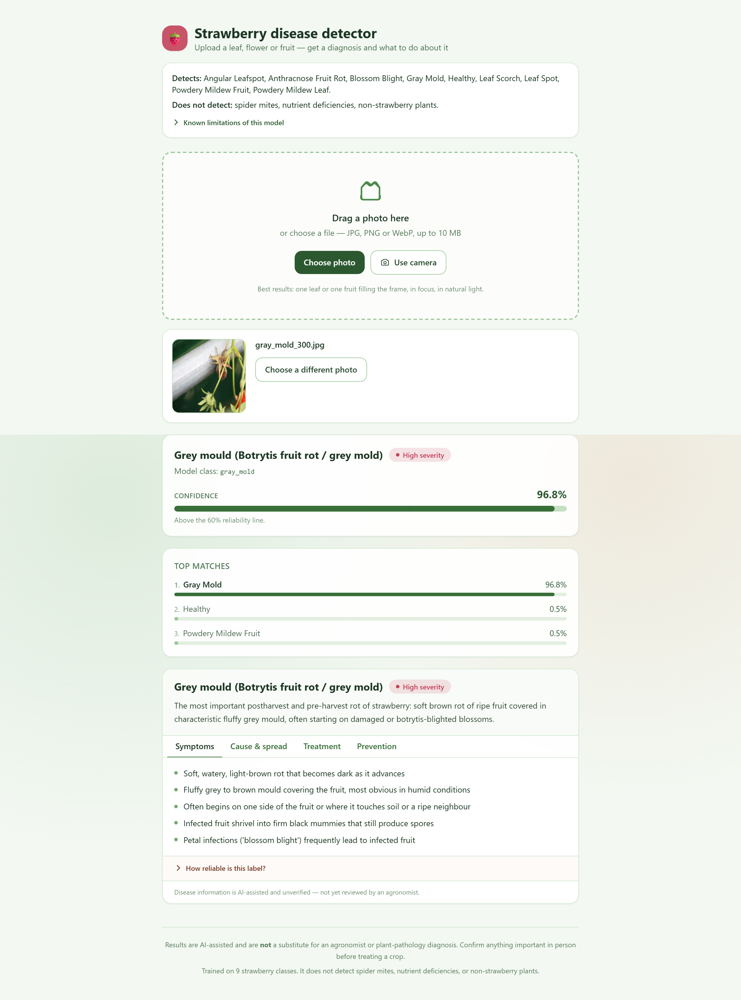
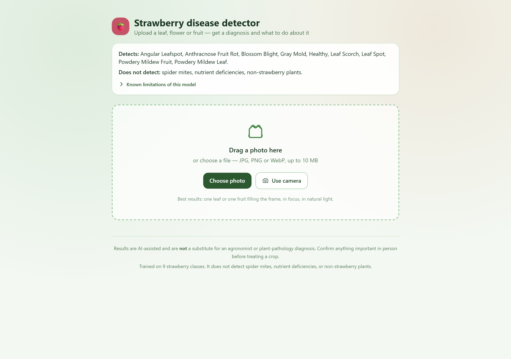
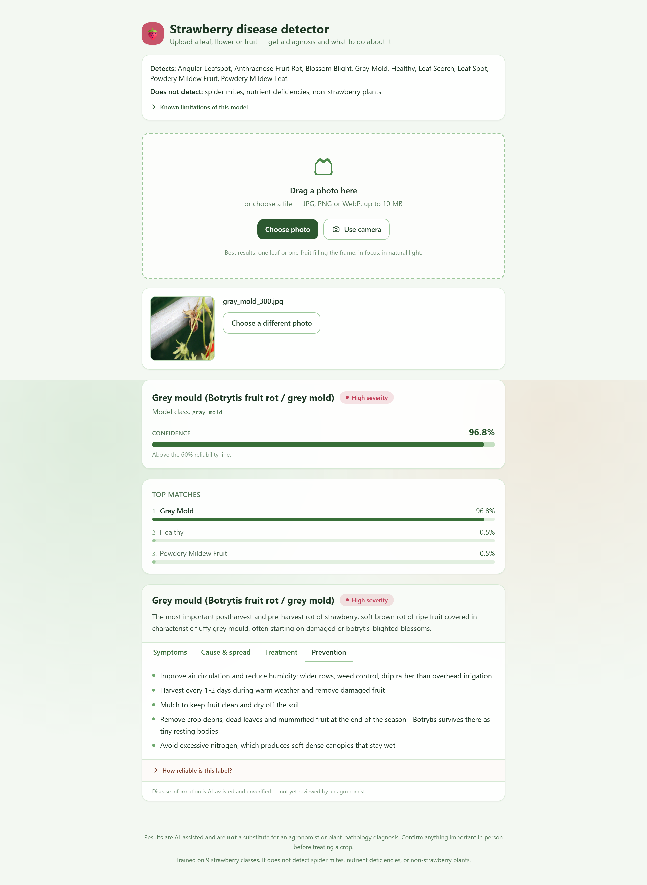
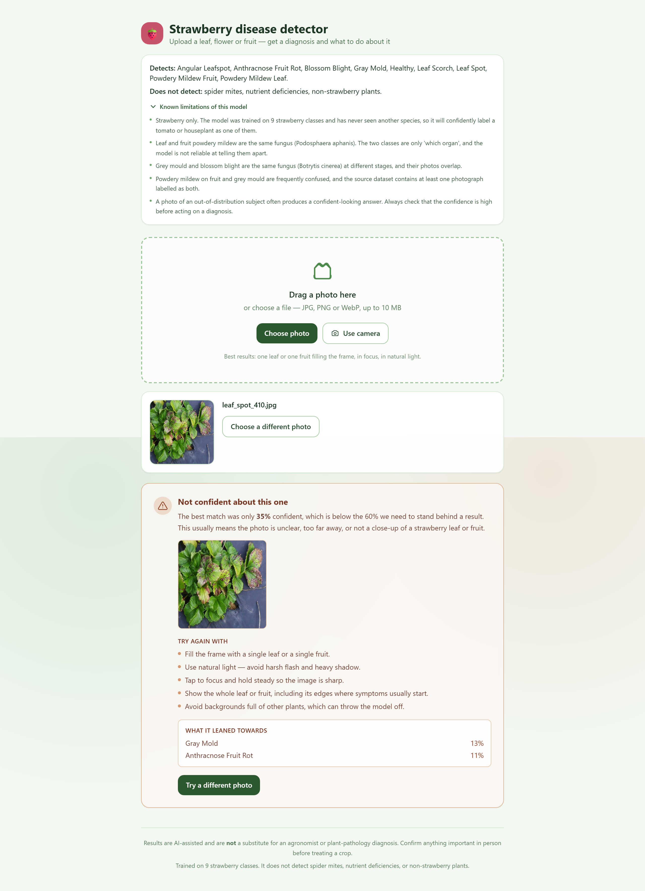
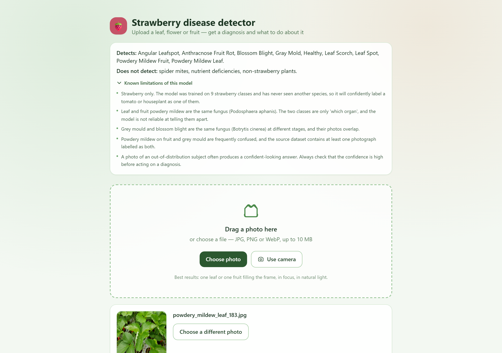
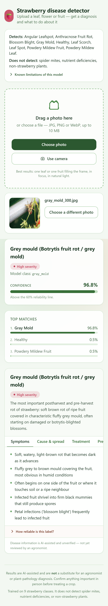
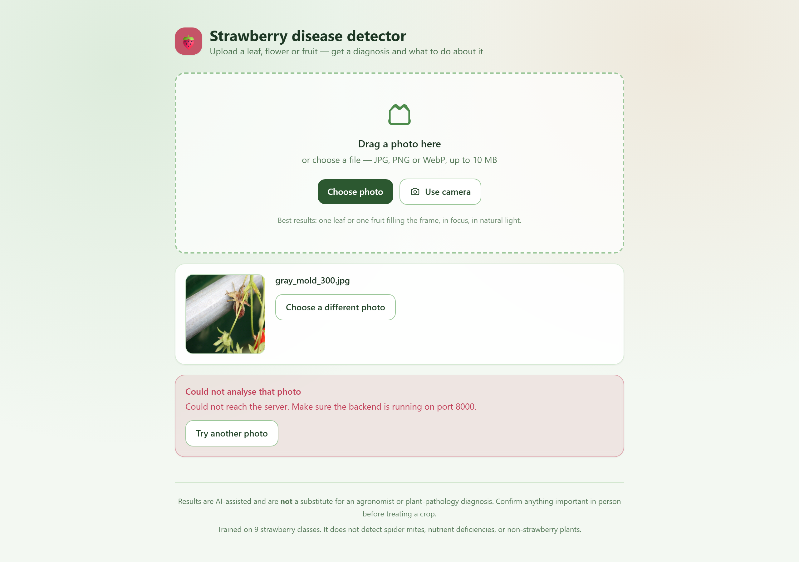

<div align="center">

# 🍓 Strawberry Disease Detector

**Point a camera at a strawberry leaf, flower or fruit. Get a diagnosis, a confidence score, the runner-up classes, and what to do about it.**

[](https://github.com/)
[](https://github.com/)
[](https://github.com/)
[](https://github.com/)
[](LICENSE)

YOLOv5 classification · FastAPI · React + Vite

[Quick start](#-quick-start) · [What it does](#-what-it-does) · [Results](#-results) · [How it works](#-how-it-works) · [Limitations](#-limitations)

</div>

---

## The problem

A grower spots a spot on a strawberry leaf. The question — *what is this, and do I need to act
today?* — usually waits on a lab result or an agronomist's visit, days that a fast-acting fungal
disease does not afford. Meanwhile the phone camera is already pointed at the plant.

**What this does:** given one photo, return the most likely disease class, a calibrated
confidence, the top-3 alternatives, and guidance. In about a second, offline, on a laptop.

## What it does

Upload or drop a photo → the model classifies it across **9 strawberry classes** → the UI shows
the diagnosis with confidence, top-3 runners-up, and a treatment card.

**Deliberately built around what the model is actually good at:**

- **Calibrated uncertainty.** A wrong answer with a low-confidence banner is far less damaging
  than a wrong answer presented as fact. The low-confidence path fires on genuinely ambiguous
  images instead of guessing.
- **Honest scope.** The UI states what the model does *not* cover — pests, nutrient deficiency,
  non-strawberry plants, severity estimation — rather than implying coverage it lacks.
- **Grouped explanations.** `gray_mold` and `blossom_blight` are the same fungus
  (*Botrytis cinerea*); `powdery_mildew_fruit` and `powdery_mildew_leaf` are the same pathogen on
  different organs. The app explains them together rather than pretending the distinction is
  as sharp as the label suggests.

<div align="center">
  
</div>

<details>
<summary><b>More screenshots</b></summary>

| | |
|---|---|
|  Landing |  Treatment guidance |
|  Low-confidence path |  Stated limitations |
|  Mobile |  Backend-down handling |

</details>

---

## Results

Held-out TEST split, 344 images never seen during training, checkpoint selected on validation.

| metric | score |
|---|---|
| **Top-1 accuracy** | **95.93%** |
| **Macro F1** | **0.8834** |
| Macro recall | 0.8773 |
| Weighted F1 | 0.9578 |
| Majority-class baseline | 0.2558 |
| Confident wrong (≥ 0.60 confidence) | 11 of 344 |

### Per class

| class | n | accuracy | F1 | |
|---|---|---|---|---|
| healthy | 88 | **1.0000** | 0.9944 | ✅ |
| leaf_scorch | 60 | **1.0000** | 1.0000 | ✅ |
| powdery_mildew_leaf | 47 | **1.0000** | 1.0000 | ✅ |
| blossom_blight | 11 | **1.0000** | 1.0000 | ✅ |
| leaf_spot | 48 | 0.9792 | 0.9895 | ✅ |
| angular_leafspot | 30 | 0.9667 | 0.9831 | ✅ |
| gray_mold | 40 | 0.9500 | 0.9048 | ✅ |
| anthracnose_fruit_rot | 8 | **0.5000** | 0.5333 | ⚠️ |
| powdery_mildew_fruit | 12 | **0.5000** | 0.5455 | ⚠️ |

**Seven of nine classes are at or above 0.95.** 13 of the 14 errors sit inside the three-way
fruit-rot cluster (`anthracnose_fruit_rot` / `powdery_mildew_fruit` / `gray_mold`); the single
error outside it is `angular_leafspot → healthy` at 0.314 confidence. **All 11 confident-wrong
answers are inside the cluster** — the rest of the model does not confidently mislead.

That 50% pair is not a tuning failure — it is a phenotype overlap. See
[Limitations](#-limitations). Full evidence, including the leakage analysis and the 13 errors in
context: **[`docs/MEASUREMENTS.md`](docs/MEASUREMENTS.md)**.

---

## Quick start

Requires Python 3.11+, Node 18+, and a CUDA GPU (developed on an RTX 3050, 6 GB). CPU inference
works but is slow.

### 1. Install

```bash
git clone <this-repo> strawberry-disease-detector
cd strawberry-disease-detector/plant_ai
```

**Install CUDA torch first**, or pip will silently resolve a CPU build:

```bash
pip install --index-url https://download.pytorch.org/whl/cu126 torch==2.14.0+cu126 torchvision==0.29.0+cu126
pip install -r requirements.txt
cd frontend && npm install && cd ..
```

Also needed: a local clone of the pinned YOLOv5 release, and the source image corpus.

```bash
git clone --depth 1 https://github.com/ultralytics/yolov5 yolov5
```

Point `STRAWBERRY_SOURCE_DATASET` at the source corpus if it is not a sibling of this directory.

### 2. Verify

```bash
python main.py check
```

Confirms torch sees the GPU, the dataset manifest is intact, and the shipped checkpoint matches
the deployed weights.

### 3. Run

```bash
python main.py serve
```

Open **<http://127.0.0.1:5173>**.

### 4. Reproduce the numbers

```bash
python main.py evaluate      # score the shipped checkpoint on TEST
python smoke_fullstack.py    # end-to-end API test through the frontend proxy
```

### All commands

| command | what it does |
|---|---|
| `python main.py check` | verify environment, dataset and checkpoint |
| `python main.py evaluate` | score on TEST → `eval/<tag>/` |
| `python main.py serve` | start backend (:8000) + frontend (:5173) |
| `python main.py verify` | score all 344 TEST images through the live API and cross-check |
| `python main.py walkthrough` | drive the UI headlessly, capture screenshots |
| `python main.py all` | `check` then `evaluate` |

Every path resolves through `paths.py`, so the working directory never matters.

<details>
<summary><b>Running the two servers by hand</b></summary>

```bash
# terminal 1
python -m uvicorn backend.main:app --host 127.0.0.1 --port 8000
# terminal 2
cd frontend && npm run dev -- --host 127.0.0.1 --port 5173
```

</details>

<details>
<summary><b>Training from scratch (optional, ~4 h on this GPU)</b></summary>

```bash
git clone --depth 1 https://github.com/ultralytics/yolov5 yolov5
cd yolov5
python classify/train.py --data ../dataset --name strawberry9val --epochs 100 --batch-size 32 \
  --imgsz 224 --class-weights --optimizer Adam --lr0 0.001 --label-smoothing 0.1
```

Class weighting and per-class augmentation are configured in `class_aug.yaml`. See
[`CONTRIBUTING.md`](CONTRIBUTING.md) for the training-cost warning and the rules that govern this
repo.

</details>

---

## How it works

```
┌──────────────┐   drag/drop    ┌──────────────┐   /api/predict    ┌──────────────┐
│  React SPA   │ ─────────────► │  Vite proxy  │ ────────────────► │  FastAPI     │
│  :5173       │ ◄───────────── │  /api/*      │ ◄──────────────── │  :8000       │
└──────────────┘   JSON result  └──────────────┘   multipart       └──────┬───────┘
                                                                            │
                                                              ┌─────────────▼─────────────┐
                                                              │  YOLOv5s-cls  ·  9 classes │
                                                              │  224×224  ·  8.1 MB       │
                                                              └───────────────────────────┘
```

| layer | choice | why |
|---|---|---|
| model | YOLOv5s-cls, ImageNet-pretrained | small enough for CPU/laptop, strong ImageNet features for a 9-class problem |
| input | 224×224, RGB | matches training; **evaluation uses RGB — a channel-order bug here was found and fixed** |
| serving | FastAPI, model loaded once at startup | fails loudly with 503 if weights are missing, so a placeholder can never masquerade as a model |
| frontend | React + Vite + Tailwind | small, fast, responsive down to mobile |
| proxy | Vite rewrites `/api/*` → backend | keeps the browser same-origin, so CORS is never exercised in dev |

### API

| endpoint | method | notes |
|---|---|---|
| `/health` | GET | model readiness, class list, thresholds |
| `/classes` | GET | class names, low-support flags, detection thresholds |
| `/predict` | POST | **multipart/form-data**, field `file`. Returns `top_class`, `confidence`, `top3`, `low_confidence` |

```bash
curl -X POST http://127.0.0.1:8000/predict -F "file=@leaf.jpg"
```

---

## Project structure

```
plant_ai/
├── main.py                 # task runner: check / evaluate / serve / verify / walkthrough
├── paths.py                # every path resolves here — no absolute paths in code
├── evaluate.py             # TEST scoring, confusion matrix, per-class metrics
├── threadcaps.py           # BLAS/OMP caps, must precede `import torch`
├── smoke_fullstack.py      # end-to-end API test through the proxy
├── backend/
│   ├── main.py             # FastAPI app
│   ├── best.pt             # deployed weights (== strawberry9val/weights/best.pt)
│   └── disease_info.json   # guidance text — ALL ENTRIES "verified": false
├── frontend/src/
│   ├── App.jsx
│   └── components/         # DropZone, DiseaseCard, Confidence, LowConfidence
├── class_aug.yaml          # per-class augmentation policy
├── dataset/                # train/ val/ test/ + manifest.csv   (gitignored)
├── eval/<tag>/             # eval.json, predictions.csv, confusion_matrix.csv
├── docs/MEASUREMENTS.md    # the full measurement record
├── LABEL_AUDIT.md          # label-quality audit, all 9 classes
└── CONTRIBUTING.md         # read this before changing anything
```

---

## Dataset

3,474 images, 9 classes, assembled from four public Kaggle sources plus PlantVillage.

| split | images | role |
|---|---|---|
| train | 2,376 | training |
| val | 686 | checkpoint selection — **never loaded during training** |
| test | 344 | held out; evaluated once, at the end |

`manifest.csv` records, per image: final class, source folder, PlantVillage flag and the evidence
for it, split, augmentation provenance, and a perceptual hash.

Class distribution is imbalanced (`healthy` 600 train images vs `anthracnose_fruit_rot` 58), which
is why training uses class weighting with a max ratio of 4.0.

---

## Limitations

Stated plainly, because a diagnosis tool that overstates itself is worse than none.

**Two classes are at 50% accuracy.** `anthracnose_fruit_rot` and `powdery_mildew_fruit` are
confused with each other and with `gray_mold` at high confidence. This is phenotype overlap, not
label noise — all 58 `anthracnose_fruit_rot` training images were inspected and are textbook
cases. Anthracnose's bleached over-ripe berry form and Botrytis' grey fuzzy mould are not linearly
separable from this imagery, and a powdery-mildew berry can be secondarily colonised by Botrytis.
**Getting this right needs better data or a reconciled labelling pass, not a hyperparameter.**

**The treatment guidance is not verified.** Every entry in `disease_info.json` is
`"verified": false`. The taxonomy is common-knowledge plant pathology, not a sourced citation.
The UI discloses this and recommends consulting an agronomist.

**Macro recall is 0.8773, short of the project's 0.90 target.** The entire gap is the fruit-rot
cluster above.

**Background bias.** PlantVillage-sourced classes score 1.0000 (n=110) against 0.9402 for
field-sourced classes (n=234) — a **+0.0598 gap**. Studio imagery has uniform grey backgrounds;
field imagery does not.

**The TEST split informed earlier recipe design.** The near-duplicate leakage component was
measured and is negligible ([`docs/MEASUREMENTS.md`](docs/MEASUREMENTS.md#near-duplicate-leakage-measured-and-it-turns-out-to-be-negligible)),
but residual optimism from the development process itself cannot be quantified without a fresh
test set.

**A label-quality audit across all 9 classes quarantined nothing** — 427 images flagged, all 427
verified correct. The labels are cleaner than the confusion matrix suggests.

---

## Data licensing — read before redistributing

| source | licence | contributes |
|---|---|---|
| `strawberry-disease-classification` | **none declared** | 56% of train, sole source of 6 of 9 classes |
| `plant-disease` | GPL 2 | part of `healthy` |
| `doctorp` | CC BY-NC-SA 4.0 | `leaf_spot`, `healthy` — **non-commercial, share-alike** |
| `tipburn` | CC BY-NC 4.0 | `healthy` — **non-commercial** |
| PlantVillage | CC BY-SA 3.0 (via arXiv:1511.08060) | `leaf_scorch`, part of `healthy` |

The largest source was renamed from `classification-mk1` to
`nizier193/strawberry-disease-classification` and declares **no licence at all** (empty licence
URL — the owner never granted terms). Under default copyright that means **all rights reserved**.

**`dataset/` is therefore not redistributable.** Two further sources are non-commercial and one is
share-alike, so no composite licence can be granted for it. The code in this repository is MIT;
the data is not. If you redistribute, you are redistributing images you have no clear right to
re-license.

---

## Contributing

**Read [`CONTRIBUTING.md`](CONTRIBUTING.md) first** — it records what has already been investigated
and ruled out, the exact API contract, and the Windows/PowerShell gotchas hit during development.

The short version:

1. **Never tune on the TEST split.** Select on validation; evaluate on TEST once.
2. **Do not rename or reshuffle `dataset/{train,val,test}`.** The published metrics are tied to it.
3. **Measure before acting.** Several plausible-sounding fixes here turned out to have nothing
   behind them — data cleaning, split leakage, licence recovery. All three are documented so they
   are not re-attempted.

## Citations

- Hughes, D. P. & Salathé, M. *An open access repository of images on plant health.* arXiv:1511.08060 — PlantVillage
- Jocher, G., Chinni, V. & Qi, X. *ultralytics/yolov5*, AGPL-3.0 — classification backbone

## License

Code: **MIT** — see [LICENSE](LICENSE).
Model weights and dataset: **see the data licensing section above; the dataset is not
redistributable.** Third-party components retain their own licences (ultralytics/yolov5 is
AGPL-3.0).
